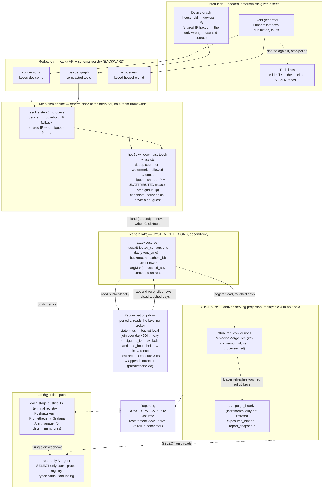

# CTV Attribution Pipeline

A seeded two-stream CTV attribution pipeline — TV exposures joined to phone/laptop
conversions across a device graph, inside a time window, duplicate- and late-tolerant —
whose output is scored against ground truth and watched by a read-only AI integrity agent.

**The constraint.** Hot-window state ≈ `exposure_rate × window_length × bytes/exposure`,
and the last term is measured, not guessed: **~571 B/exposure** (`make scale-curve`,
[`docs/SCALING.md`](docs/SCALING.md)). At 25k exposures/s held for 7 days that is
**~8.6 TB** of processor state — no single node holds it.

**The answer is two attribution paths, one truth.** A deterministic hot path holds 7 days
of exposures and credits last-touch only when the household is certain. A periodic
reconciliation pass reads the Iceberg lake of record bucket-locally over 90 days, recovers
the late tail, settles the shared-IP ambiguities the hot path refuses to guess, and
restates the reported numbers.

**Accuracy and restatement** (household grain, engine output vs the truth side file —
every cell is pinned in `tests/pins.py` and guarded by `tests/test_docs_accuracy_pins.py`):

| profile | credited | truth | correct | precision | recall | what it shows |
|---|---|---|---|---|---|---|
| `tiny` (hot) | 47 | 35 | 32 | 0.681 | 0.914 | last-touch organic over-credit; 0 wrong-household; 3 caused shared-IP conversions (of 5 deferred) settled by reconciliation |
| `medium` (hot) | 129 | 92 | 91 | 0.705 | 0.989 | dedup + hour-late arrivals; 1 caused shared-IP conversion deferred |
| `long_delay` (hot only) | 80 | 75 | 44 | — | 0.587 | days-late conversions miss the 7d hot window |
| `long_delay` (post-reconcile) | 112 | 75 | 73 | — | 0.973 | reconciliation recovers 29 caused misses + 3 deferrals; every campaign's ROAS restated up |

**Query cost levers** (ClickHouse, `bench_large` profile, regenerated by `make cost-levers`
into [`docs/RESULTS.md`](docs/RESULTS.md); the direction is the claim, not the magnitude):

| lever | result | measured |
|---|---|---|
| projection ordered by `event_time` | WIN | 1.54× fewer rows on a date-scoped slice |
| FINAL-avoidance (`argMax` GROUP BY) / bloom skip index | DOCUMENTED NEGATIVE | `FINAL` reads 0.26× the bytes of the manual collapse; the skip index prunes 0 granules |
| PREWHERE the window predicate | WIN | 1.21× fewer bytes, same rows |
| incremental rollup refresh (dirty set, `make rollup-bench`) | WIN on writes | 1.1× fewer rows written (only changed keys rewritten; here reconcile restates 156 of 165); reads do not fall even at ~7 granules — the dirty keys span every granule |
| async inserts on the loader (`make run`, Phase 18b) | WIN on write parts | `async_insert=1, wait_for_async_insert=1` → fewer, larger parts; serving rows byte-identical, off in the golden paths |
| per-query cost (`make cost-report` → `query_cost_daily`) | MEASURED | cpu-seconds + illustrative $ per report/restate/bench query; quarantined non-determinism, no pipeline path reads it |

**Agent eval:** 30/30 correct diagnoses, false-positive rate 0/10 = 0% (recaptured
2026-08-23, live, 30 invocations; the near-miss pair — genuine lift vs shared-IP
inflation — held both ways, in Phase 10 and again on the recapture).

**What this does NOT show.** This is a simulation of the pipeline *shape* attribution
requires, not a reproduction of any vendor's device graph or integrations. The engine
is a bounded batch drain over the topics on a single node, not a continuous follow;
every number is laptop-scale (16 GB laptop, Docker Compose, agent evals under $10 in
API tokens) and reported as measured (`docs/SCALING.md` says where the design breaks
at 50k/s and 500k/s).

```bash
make down && make lake-reset CONFIRM=yes && make up && make seed PROFILE=tiny && make run-hot && make eval && make report
```

## Architecture



The lake (heavier border) is the system of record — every row reaches ClickHouse
through it; dotted edges are off the critical path. The full stage-by-stage
walk-through, with the stream concepts (compacted topic, watermark, ReplacingMergeTree,
bucketing) explained where they first appear, is
[`docs/ARCHITECTURE.md` §3](docs/ARCHITECTURE.md#3-architecture).

## Documentation

Each concern lives in the doc that owns it; this README is the map.

| Concern | Doc |
|---|---|
| The spec — components, decisions, and the stack-gotcha log | [`docs/ARCHITECTURE.md`](docs/ARCHITECTURE.md) |
| The build plan — phases and their Done-when checks | [`docs/PHASES.md`](docs/PHASES.md) |
| Headline numbers — accuracy, benchmark, cost levers, agent eval | [`docs/RESULTS.md`](docs/RESULTS.md) |
| On-call runbook — four post-incident writeups + known limitations | [`docs/RUNBOOK.md`](docs/RUNBOOK.md) |
| Where the design breaks at 50k / 500k, and what changes | [`docs/SCALING.md`](docs/SCALING.md) |
| Why-not-X log — decisions in force, then a per-phase appendix | [`DECISIONS.md`](DECISIONS.md) |
| Deferred findings, each with a revisit trigger | [`BACKLOG.md`](BACKLOG.md) |
| Commands, invariants, conventions, and the tooling index | [`CLAUDE.md`](CLAUDE.md) |

## How it's proven

Full numbers and method in [`docs/RESULTS.md`](docs/RESULTS.md); the accuracy tables are
pinned (`tests/pins.py` via `tests/test_docs_accuracy_pins.py`), the scale-curve and
cost-lever blocks are `make`-regenerated (first-screen copies checked by `make
check-docs`), and the agent-eval and lakehouse tables are dated captures.

- **Determinism is the core principle.** Same `PRODUCER_SEED` + profile →
  byte-identical topics and identical attribution output; breaking it is a bug. The
  pipeline **never reads the truth links** (a structural test forbids the word in
  pipeline packages) — accuracy is scored against the side file in the eval harness.
  Every write to `attributed_conversions` is idempotent, so replaying any topic from
  offset 0 converges to the same ClickHouse state. The lake's metadata and the agent's
  output are the two carve-outs; every asserted check reads row content back.
- **Accuracy vs ground truth** (the first-screen table). Household grain isolates the
  real failure mode — wrong-household shared-IP attribution; precision below 1.0 on the
  clean profiles is last-touch organic over-credit, a model property. Wrong-household
  credit can only happen on the reconciled path, exercised by `shared_ip_spike`
  (69/80 correct, 11 wrong-household — observed, not assumed).
- **Lake-of-record parity.** Lake-loaded serving rows == the direct-write oracle's rows;
  an accumulated lake reloads byte-identically; the bucket-aligned reconcile == the
  single in-memory pass on `long_delay` and `shared_ip_spike` (`make test-int-lakehouse`).
- **Benchmark.** The `campaign_hourly` rollup reads **2.5× fewer rows** than the naive
  full-`FINAL` scan-and-join (`make bench`, both sides at merged steady state), with a
  magnitude-free direction assert; the naive scan grows with every event, the rollup
  read is bounded by `(campaign, hour)`.
- **Alert rules** — five, promtool-proven against REAL captured stage registries (`make
  test-alerts`) and evaluated **live** since Phase 18b (each batch stage pushes its
  terminal registry to a Pushgateway that Prometheus scrapes). They detect *operational*
  faults, not inflation — a green alert board does not mean the numbers are right, which
  is the agent's job.
- **Agent eval** — every fault profile plus a no-fault baseline, 5× each: **30/30
  correct, false-positive 0/10** (`make agent-eval`, 2026-08-23 capture). `shared_ip_spike`
  → `device_graph_mismatch`, `real_lift` → `real_performance_change` (never confused);
  `co_view_bug` correctly **abstains** — a labeled capability boundary, kept out of the FP
  denominator. Non-reproducible by construction (no temperature on the Claude-5 family),
  so the reps measure stability.

## Scaling

The written deliverable is [`docs/SCALING.md`](docs/SCALING.md): the constraint that
breaks first (hot-window state, the measured ~571 B/exposure above), the partition math
(parallelism = partition count; the household-keyed re-partition a multi-partition
engine needs), what changes at the **50k/s** and **500k/s** tiers (state backend,
stream processor — the Flink mapping is the port target, continuous follow a
post-roadmap decision the phases through 18b did not take on — and ClickHouse: larger
async-insert buffers (the async lever itself is built, Phase 18b) and sharding by
`household_id`), and the lake's scale port (object store + REST catalog, Spark/Trino
running the same SQL DuckDB runs here).
Bucketing is what keeps the 90-day reconcile join shuffle-free: a household's exposures
and its candidates' exploded rows hash to the same bucket of every day partition.

## Quickstart

Requirements: Docker (16 GB), `uv`, `make`. First-time setup: `make setup` (uv sync +
pre-commit). `make up` brings the stack up with health checks, not sleeps. Two state
stores: the Iceberg lake under `data/lake/<profile>/` outlives `make down`, and
ClickHouse is loaded from it — so a clean state is `make down && make lake-reset
CONFIRM=yes`, two commands, on purpose.

```bash
# Hot-path headline — fast, stable pins (a clean stack is a clean lake)
make down && make lake-reset CONFIRM=yes && make up && make seed PROFILE=tiny && make run-hot && make eval PROFILE=tiny && make report

# Reconciliation + restatement (recall 0.587 → 0.973, ROAS restated up)
make down && make lake-reset PROFILE=long_delay CONFIRM=yes && make up && make seed PROFILE=long_delay && make run PROFILE=long_delay && make eval PROFILE=long_delay && make report && make restate

# Replay the serving layer from the lake — no Kafka (after either demo)
make replay-serving PROFILE=<p> CONFIRM=yes && make eval PROFILE=<p>
```

`make run` is engine (resolve in-process) → Iceberg lake → Dagster load → ClickHouse →
reconciliation (lake → append → reload), a single pass, not a daemon. `make run-hot`
stops before reconciliation and backs the hot-path oracle suites. Eleven profiles live
under `producer/profiles/`: `tiny`, `medium`, `long_delay`, six fault/control profiles
(`shared_ip_spike`, `late_burst`, `co_view_bug`, `real_lift`, `duplicate_flood`,
`no_fault_baseline`) and two volume profiles (`bench_large`, `scale_curve`). The two
LLM paths — `make agent-run` and `make agent-eval` — cost API tokens; **ask before
running** (they load `ANTHROPIC_API_KEY` from `.env`). Every other entry point
(`make report` / `restate` / `bench` / `cost-levers` / `rollup-bench` / `cost-report` /
`scale-curve` / `context` / `eval` / `test` / `test-int` / `test-alerts` / `check-docs`)
is in the full command reference: [`CLAUDE.md`](CLAUDE.md) → Commands.

Service UIs once `make up` is healthy: ClickHouse `:8123`, Prometheus `:9090`,
Alertmanager `:9093`, Grafana `:3000`, Pushgateway `:9091`, Redpanda Kafka API `:19092`
(all bound to `127.0.0.1`).

## Repo map

```
producer/        seeded generator, device graph, profiles/, pydantic schemas (source of truth)
resolve/         conversion → household resolution (in-process map step; device, IP fallback, fan-out)
streaming/       attribution engine: pure core + batch-drain driver (window, dedup, lateness, eviction)
lake/            Iceberg lake of record: catalog, schemas, landing, DuckDB reads, ClickHouse loader
orchestration/   Dagster assets (lake → ClickHouse load, day-partitioned reconcile) + headless CLI
reconcile/       periodic long-window matcher over the lake, rollup, snapshots
clickhouse/      DDL, users (agent_ro SELECT-only; metrics_ro metadata-only; cost_rw query_log→cost table), migrations
queries/         reporting SQL, restatement view, naive-vs-optimized benchmark, cost levers
observability/   prometheus.yml, 5 alert rules, the clickhouse_ scrape, grafana (JSON)
agent/           collectors, hypothesis catalog, probe registry, loop, webhook, eval/
accuracy/        household-grain precision/recall vs the truth side file
common/          kafka.py — the shared start→end topic drain (engine + graph loader)
scripts/         the offline guards — check_docs.py (make check-docs), review_gate.py (make review-gate), mutate.py (make mutate), round_tag.py (the review-round-N boundary tag), review_common.py
tests/           pytest unit (no services); tests/integration/ against the stack; pins.py
fixtures/tiny/   golden producer output + expected resolved/attributed rows (read-only)
docs/            ARCHITECTURE.md (spec) · PHASES.md · SCALING.md · RESULTS.md · RUNBOOK.md
DECISIONS.md     decisions in force + per-phase why-not-X log · BACKLOG.md deferred findings
```

## History

Built in phases, one branch + one PR each, every phase behind a review gate
(code-reviewer, security-reviewer, functionality-tester, coherence-auditor — all
report-only). Phases 0–11 were the plan ([`docs/PHASES.md`](docs/PHASES.md)); 12–19 are
post-plan extensions. Dates are 2026; the Spec cell is the `specs/` file where one was
cited. Rationale per phase: [`DECISIONS.md`](DECISIONS.md).

| Phase | Date | PR | Deliverable (headline result) | Gate | Spec |
|---|---|---|---|---|---|
| 0 | 08-17 | #2 | Scaffolding — compose, Makefile, CI skeleton | — | — |
| 1 | 08-17 | #3 | Event models, seeded generator + knobs (incl. unknown-device), schema registration, tiny golden fixtures (frozen read-only) | — | — |
| 2 | 08-17 | #4 | Resolve stage: device→household, IP fallback, ambiguous fan-out; `ResolvedConversion` schema (compat NONE); offline replay + golden `fixtures/tiny/expected/`; live batch drain + `resolve_` metrics | — | — |
| 3 | 08-17 | #5 | Attribution engine — pure last-touch join + conversion_id-keyed ambiguous reduce (shared by replay + Bytewax); `attributed_conversions`/`exposures_landed` RMT + sync sink; CI integration job (SHA-pinned actions, digest-pinned images) | — | — |
| 4 | 08-18 | #6 | **CHECKPOINT** — household-grain accuracy (precision 0.673 / recall 1.000, N1 side-file join) + report v1 (4 per-campaign metrics: ROAS/CPA/CVR/site-visit) | PASSED | — |
| 5 | 08-18 | #7 | Engine hardening — arrival-ordered, watermark-gated, evicting operator; dedup seen-set, allowed-lateness release, 7d eviction; `medium` profile; evicting == non-evicting oracle byte-identical (92/130, recall 1.0, wrong_hh 0, dedup suppressed 70) | PASSED | — |
| 6 | 08-18 | #8 | Reconciliation + restatements — periodic ≤90d matcher (`reconcile/`) recovers hot-misses via the shared leaf; `campaign_hourly` + `report_snapshots`; `long_delay` profile; 32 candidates → 29 recovered, recall 0.587→0.973, all 3 campaigns' ROAS restated up | PASSED | `phase-6` |
| 7 | 08-19 | #9 | **CHECKPOINT** — benchmark + observability; 4 metrics (incl. `engine_join_state_current`, closes BACKLOG 25); `make bench` (rollup 2.5× fewer rows / 1.6× bytes / 2.6× faster — as captured then; the 1.6× byte win was un-merged part bloat, re-measured at merged steady state by `fix/bench-direction-guard`: 1.2× bytes / ~1.8× faster, RESULTS "Why the numbers moved"); 4 promtool-proven alert rules (fire on long_delay, silent on tiny); Grafana dashboard | PASSED | `phase-7` |
| 8 | 08-19 | #10 | Fault harness — 5 isolated fault profiles (one anomaly each: shared_ip_spike, late_burst, co_view_bug, real_lift, duplicate_flood) + LLM-free collectors build §4.2 `AttributionContext` from ClickHouse (N1), shape FROZEN as the Phase-9 contract; shared_ip_spike caused_wrong_household=11 | PASSED | `phase-8` |
| 9 | 08-19 | #11 | Agent loop — 6-cause hypothesis enum + 5 parameterized-SQL probes over SELECT-only `agent_ro` (no free-form SQL); typed `AttributionFinding` (fail → AMBIGUOUS_NEEDS_HUMAN); manual tool-use loop (Sonnet-5); Alertmanager webhook (trigger-only, alert text never reaches LLM). Live: device_graph_mismatch CONFIDENT | PASSED | `phase-9` |
| 10 | 08-19 | #12 | **CHECKPOINT** — agent eval + near-miss demo; `no_fault_baseline` profile; frozen 6-scenario catalog + PURE scoring; `make agent-eval` → **30/30 correct, false-positive 0/10 = 0%** (real_lift vs shared_ip_spike both clean; co_view_bug 5× AMBIGUOUS; late_burst 5× CONFIDENT) | PASSED | `phase-10` |
| 11 | 08-20 | #13 | Docs (final planned phase, no pipeline code) — `README.md` design doc, `docs/SCALING.md` (hot-window-state constraint, partition math, 50k/500k tiers, Bytewax→Flink mapping), `docs/RESULTS.md` accuracy tables (tiny 0.673/1.000, medium 0.708/1.000, long_delay 0.587→0.973 — the pre-Phase-16 hot numbers; since the Phase-16 deferral tiny is 0.681/0.914 and medium 0.705/0.989, the first-screen table); no new numbers invented | PASSED (coherence BLOCKER — false "async inserts on" claim — fixed to a SCALING lever) | none (docs) |
| 12 | 08-20 | #21 | *post-plan* — lakehouse landing + orchestrated reconciliation: local Iceberg exposure lake (`lake/`) + Dagster day-partitioned assets (`orchestration/`); an optional dual-write (superseded by Phase 17: the lake is now the record), byte-identical parity (ClickHouse == Iceberg-sourced reconcile); +5 packages (approved) | PASSED | `phase-12-lakehouse-landing` |
| 13 | 08-20 | #20 | *post-plan* — query cost levers on `bench_large`: projection-by-`event_time` WINS, FINAL-avoidance / skip-index DOCUMENTED NEGATIVE, PREWHERE WINS; lever DDL only inside `make cost-levers`, gate-0 golden untouched | PASSED (BLOCKER + drift cleared on re-check) | `phase-13-query-cost-levers` |
| 14 | 08-20 | #19 | *post-plan* — measured scaling curve: `make scale-curve` drains the real engine over 1k/10k/100k tiers → **~571 B/exposure** (→ ~8.6 TB extrapolation at 25k/s × 7d); tracemalloc console-only, never committed | PASSED (coherence BLOCKER — tracemalloc-in-doc non-idempotency — CLOSED) | `phase-14-scaling-curve` |
| 15 | 08-20 | #18 | *post-plan* — runbook + incident log (`docs/RUNBOOK.md`): 2 incidents (CI benchmark FINAL read_rows; tz round-trip snapshots) + batch-drain limitation; neither is alert-covered (said so); `make check-runbook` trace check (now `make check-docs`, Phase 19) <!-- historical --> | PASSED | `phase-15-runbook` |
| 16 | 08-21 | #28 | *post-plan* — simplify the core (deletion-first): ambiguous shared-IP conversions deferred hot (reason ambiguous_ip) → hot wrong-household 0 by construction, reconciliation owns the one most-recent-exposure tiebreak (`pick_household`, candidates re-enumerated from `device_graph`); resolve is an in-process map step (`conversions_resolved` topic/subject/stage gone — two event topics); Bytewax removed (`dataflow.py` drives `attribute.py`; `-1` package). Pins: tiny hot 47/35/32, medium hot 129/92/91, long_delay hot 80/75/44 → post 112/75/73 (recall 0.587→0.973 unchanged); shared_ip_spike post-reconcile 69/80 (== old hot). `reason` column (ambiguous_ip \| state_miss, null when attributed) added to the attributed model/DDL/sink; tiny `expected/attributed.jsonl` re-frozen once with sign-off (5 decision rows change; all rows gain `reason`) | PASSED (4 review agents × 3 passes; 0 blockers at exit) | `phase-16-simplify-core` |
| 17 | 08-21 | #31 | *post-plan* — lake of record: the Iceberg lake (`raw.exposures` + `raw.attributed_conversions`, `day × bucket(8, household_id)`) is the system of record and ClickHouse a derived projection loaded by Dagster per touched day; `candidate_households` persisted on the deferred row (19-column contract) so reconciliation explodes it and needs no device graph / broker; bucket-aligned reconcile over the lake (== single pass byte-for-byte on long_delay + shared_ip_spike); `--lake-land`/dual-write gone; `make replay-serving` (Kafka-free), `make lake-reset` (one of the three destructive paths, `lake/destructive.py`), `make lake-maintain`; tiny golden re-frozen once (additive column, 0 decision changes — now a rule); clickhouse-connect naive-datetime write gotcha found live. Every pin unchanged | PASSED (3 review rounds — see DECISIONS "Process") | `phase-17-lake-of-record` |
| 19 | 08-22 | #33 | *post-plan* — docs reshape (runs BEFORE 18a/18b, DECISIONS "Process"): README first screen = constraint → two paths → pinned tables; DECISIONS split into "still in force" + per-phase appendix, superseded entries annotated in place; ARCHITECTURE §3 as the post-17 end state; CLAUDE.md status table moved here; `make check-docs` = links/anchors + generated-block + exact-token guard (was `check-runbook`; closes BACKLOG 37) | merged 08-22 | `phase-19-docs-reshape` |
| 18a | 08-22 | #38 | *post-plan* — cost and ops levers, first half: the Dagster loader records the `(campaign_id, hour)` keys each load touches (`rollup_dirty`) and refreshes them after every load — the rollup row's version is `max(stamp)` over the summarized rows (data-derived, no caller offset), so the reconcile pass's reload is a genuinely incremental second pass (19 of 340 keys rewritten, 17.9× fewer rows written; reads unchanged at one granule). Per-key watermark (`rollup_refreshed`), never a global max: the first cut left 321 of 340 keys permanently unrefreshed. `report_snapshots` gains `snapshot_version` as its RMT version (migrated by create → backfill → `exchange tables` → drop; ClickHouse has no `alter … modify engine`). Storage measured by a one-shot `clickhouse_` scrape as a SELECT-only `metrics_ro`; ONE new alert rule, `PartCountHigh > 150` (the server's `parts_to_delay_insert`) — silence from real captures, firing from a labelled synthetic input; no merge-lag rule, because no capture can fire one. `queries/bench_common.py` graduated | merged 08-23 | `phase-18a-cost-and-ops` |
| 18b | 08-23 | #39 | *post-plan* — cost and ops levers, second half: async inserts on the loader (`async_insert=1, wait_for_async_insert=1`, `LAKE_ASYNC_INSERT=1` in `make run`, off in golden paths; serving rows byte-identical, no read-after-load race — proven live). Per-query cost from `system.query_log` into `query_cost_daily` (RMT `(day, query_tag)`) via a new SELECT-`system.query_log`+INSERT-only `cost_rw` writer; cpu-seconds + illustrative $ (config rate, never SQL); quarantined non-determinism, no pipeline path reads it. Schema registry set to BACKWARD (add-optional accepted, remove-required 409 — proven live). Live alert firing PATH: batch stages push their terminal registry to a digest-pinned Pushgateway, Prometheus scrapes it and the five rules evaluate on live data (`RestatementMagnitude` ACTIVE proven live); Alertmanager routes firing → `agent/webhook.py`, proven with a synthetic alert; webhook dedupes by `groupKey` (one sweep per group). Shard-key note: `household_id`. `for: 5m`→AM-firing timing stays promtool's (amendment 2) | merged 08-23 | `phase-18b-cost-and-ops` |

The planned roadmap is **complete** — all phases (0–19, 18a, 18b) merged. Next work is
BACKLOG-driven, not a pre-planned phase (top candidate: a Phase-20 Decimal64 money
migration); specs live under `specs/`, reconciled against main before each branch opens.

**Follow-on / standalone fix PRs** (each its own branch off main, same review discipline):
- `fix/bench-direction-guard` (PR #14) — magnitude-free bench direction assert + `_canonicalize` OPTIMIZE for deterministic `read_rows` (BACKLOG 29; the helper is `queries/bench_common.py` `canonicalize` since Phase 18a).
- `fix/agent-env-load` (PR #15) — `agent-run`/`agent-eval` auto-load `.env` via `uv run --env-file`, guarded + scoped (BACKLOG 34; security-review PASS).
- `fix/eval-demo-profile` (PR #23) — `make eval` PROFILE prose + long_delay demo fixed; the durable profile/DB-mismatch guard and the `Makefile:128-129` comment twin shipped in `fix/eval-profile-guard` (BACKLOG 43).
- `fix/eval-profile-guard` (PR #25) — fail-loud eval profile/DB-mismatch guard: `eval_meta` marker stamped by every populate target (run/run-hot/metrics-capture; since Phase 17 also replay-serving), asserted `== --profile` in `accuracy/run.py`; closes BACKLOG 43 incl. the Makefile:128-129 comment twin. Marker off the golden path, no timestamp → gate-0 byte-identical.
- `fix/make-resolve-source` (PR #29) — two pre-existing Makefile bugs surfaced by the Phase-16 review: bare `make resolve` exited 2 (`SOURCE ?= fixtures  # …` carried trailing spaces into `--source`), and `test-int-medium` stamped `eval_meta=tiny` over a medium DB (ran `run-hot` without `PROFILE=medium`, so the BACKLOG-43 guard could not fire). `tests/test_makefile.py` guards both offline via `make -n`.
- `fix/docs-accuracy-pin` (PR #26) — single-sourced the household-grain accuracy pins into `tests/pins.py` (tiny/medium/long_delay), referenced by the 5 test suites, plus `tests/test_docs_accuracy_pins.py` asserting the README/RESULTS accuracy TABLE cells equal them; closes BACKLOG 36. Table-scoped — prose citations deferred to BACKLOG 47.

**Tooling / process PRs** (not phases — no phase gate, no PHASES.md row; listed so the record is complete):
- `docs/process-tightening` (PR #32, merged 08-22) — `specs/TEMPLATE.md` Evidence / Record updates / Threat model sections; spec finalized only after its predecessor merges; ≤ ~6 items per spec; the "Before reporting DONE" self-review.
- `docs/review-invariants` (PR #34, merged 08-22) — Invariants-first specs, fix amendments, the two-round review cap, scoped re-review; agents gain the Invariants check and the Mutation step.
- `tooling/review-round` (PR #35, merged 08-22) — `make review-gate`, `make mutate`, `/review-round N`; the judgment-free edges of the review loop as scripts, three judgments left human (DECISIONS "Process").
- `fix/make-quote-profile` (PR #36, merged 08-23) — every recipe quotes user variables through `$(call _Q,$(value VAR))` and `unexport`s the seven of them (incl. `CONFIRM`), closing both the recipe-time and the make-startup `$(shell …)` expansion vectors on both origins (`make -n` shows only the first). Phase-17 residual, closed.
- `fix/review-gate-pytest9` (PR #37, merged 08-23) — `make review-gate`'s Evidence check went silently broken under pytest 9 (the `-qq` collection-summary format changed, so `collected_ids` returned zero and every spec passed vacuously); fixed the collector parse for `make review-gate` + `make mutate`. The gate runs in no automated check, so it surfaced only when a human ran it (BACKLOG).

## Next steps — what was cut, and why

Everything here was a deliberate scope cut, not an oversight. Each is a written note,
not speculative code.

- **Continuous Kafka follow.** The engine is a bounded batch drain in plain Python.
  Windowing, watermarks, and eviction are all real, but on the drain. Moving to an
  unbounded continuous follow — and choosing the framework for it, Bytewax proper vs
  Flink — is a post-roadmap decision (the phases through 18b did not take it on), and it
  is the trigger for the next two items.
- **TTL'd dedup state.** Batch dedup is a full seen-set, correct because the whole stream
  is in memory. Under continuous follow an unbounded seen-set is a memory leak; it
  becomes TTL'd state keyed on `event_time + max_resend_delay`. The seeded duplicate is
  timestamp-identical to its original, so a real deployment (with genuinely-later re-send
  timestamps) is needed to exercise TTL sizing — see SCALING.md.
- **Live Alertmanager firing path — delivered (Phase 18b).** Was a scope cut through
  Phase 17 (the batch stages exit before a pull-scrape). Phase 18b built the push path:
  each stage pushes its terminal registry to a Pushgateway that Prometheus scrapes after
  the stage exits, the alert rules evaluate on live data, and Alertmanager routes firing
  alerts to the agent webhook. Kept in this list as a delivered-since note (see the
  History row and ARCHITECTURE §3.3), not a standing cut.
- **Co-view adjustment as a reporting factor** — a won't-do. The honest per-genre
  expected baseline does not exist in serving data, and sourcing it from the producer's
  multiplier would couple reporting to generation parameters. Co-viewing stays a
  producer-realism knob; the `co_view_bug` fault is scored as a labeled capability
  boundary the agent correctly abstains on (DECISIONS Phase 10).
- **Lake at scale.** Object store + REST catalog, Spark/Trino compute, a containerized
  Dagster webserver — the SCALING port of the lake of record, not built
  (ARCHITECTURE §5, SCALING.md).
- **Multi-touch models, schema evolution beyond v1, co-view inside the engine** — out of
  scope for v1 (ARCHITECTURE §3.5). Multi-touch is intentionally a *query* over the
  recorded assists, not a re-run.
